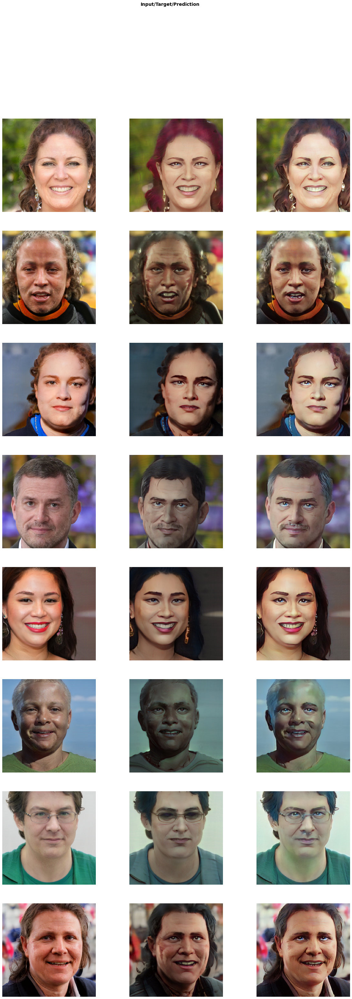

# ArcaneAnimeGAN
AnimeGAN2 trained on Arcane  
trying to follow bryandlee animegan2 training methodology  
  
# Result   
    

# Training Workflow
- Get video data
- Split video into frames
- Align frame image using face-alignment
- Filter blurry image using opencv Laplacian
- Zip image dataset for fit into styleGAN
- Finetune FFHQ pretrained styleGAN using created zip dataset
- Blend findtuned styleGAN weight and pretrained styleGAN weight 
- Create data pair using blended styleGAN model and pretrained model
- Train animeGAN using paired data
  
# To Do
- Use animegan vgg19[0,255] instead of vgg19_bn[0,1]
- Add canny edge method to gaussigan blur
- Background segmentation
  
# Required environment to run    
```python
!conda install pytorch torchvision cudatoolkit=11.1 -c pytorch -c nvidia -y
!sudo apt install ffmpeg
!pip install face-alignment
!pip install --upgrade psutil
!pip install kornia
!pip install fastai==2.5.3
!pip install opencv-python
!git clone https://github.com/NVlabs/stylegan3.git
```
  
# Acknowledgement and References  
- [AnimeGAN](https://github.com/TachibanaYoshino/AnimeGAN)  
- [AnimeGANv2](https://github.com/TachibanaYoshino/AnimeGANv2)  
- [animegan2-pytorch](https://github.com/bryandlee/animegan2-pytorch)  
- [animegan2-pytorch-Face-Portrait-v1](https://github.com/bryandlee/animegan2-pytorch/issues/3)  
- [pytorch-animeGAN](https://github.com/ptran1203/pytorch-animeGAN)  
- [AnimeGANv2_pytorch](https://github.com/wan-h/AnimeGANv2_pytorch)  
- [AnimeGAN_in_Pytorch](https://github.com/XuHangkun/AnimeGAN_in_Pytorch)  
- [AnimeGAN-torch](https://github.com/MrVoid918/AnimeGAN-torch)  
- [style_transfer_implementation](https://github.com/Snailpong/style_transfer_implementation)  
- [Anime-Sketch-Coloring](https://github.com/pradeeplam/Anime-Sketch-Coloring-with-Swish-Gated-Residual-UNet)  
- [CartoonGAN-Tensorflow](https://github.com/taki0112/CartoonGAN-Tensorflow)  
- [cartoon-gan](https://github.com/FilipAndersson245/cartoon-gan)  
- [pytorch-implementation-of-perceptual-losses](https://towardsdatascience.com/pytorch-implementation-of-perceptual-losses-for-real-time-style-transfer-8d608e2e9902)  
- [Artistic-Style-Transfer](https://kyounju.tistory.com/3)  
-   
- [animegan2-pytorch-arcane](https://github.com/bryandlee/animegan2-pytorch/issues/17)  
- [DeepStudio](https://github.com/bryandlee/DeepStudio)  
- [ArcaneGAN](https://github.com/Sxela/ArcaneGAN)  
- [stylegan3_blending](https://github.com/Sxela/stylegan3_blending)  
- [toonify](https://github.com/justinpinkney/toonify)  
- [BlendGAN](https://github.com/onion-liu/BlendGAN)  
- [Cartoon-StyleGAN](https://github.com/happy-jihye/Cartoon-StyleGAN)  
- [FFHQ-Alignment](https://github.com/happy-jihye/FFHQ-Alignment)  
- [FFHQ-dataset](https://github.com/NVlabs/ffhq-dataset)
- [face-alignment](https://github.com/1adrianb/face-alignment)  
- [stylegan3](https://github.com/NVlabs/stylegan3)  
- [FreezeD](https://github.com/sangwoomo/FreezeD)  
- [Image-Blur-Detection](https://github.com/priyabagaria/Image-Blur-Detection)  
- [Classifying_image_blur_nonblur](https://github.com/pranavAL/Classifying_image_blur_nonblur)
- [arcane](https://www.netflix.com/kr/title/81435684)

